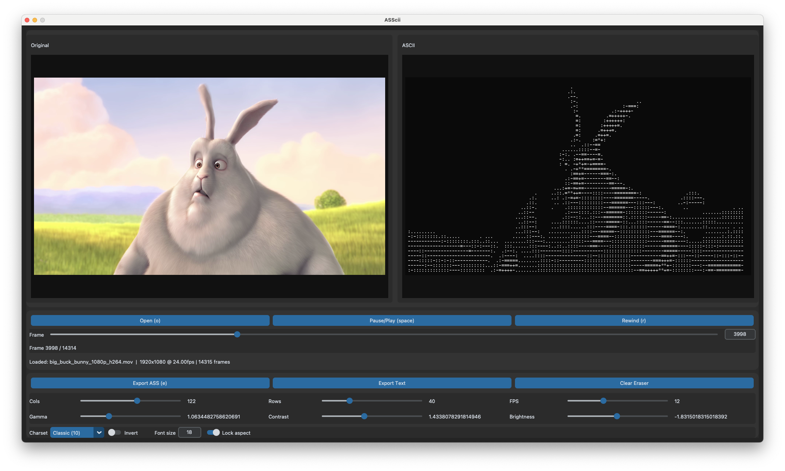

# ASScii: Video-to-ASS ASCII subtitle generator

[日本語](README.ja.md)

ASScii is a Tkinter-based desktop tool that converts videos into live ASCII art and exports every rendered frame as Aegisub-compatible ASS subtitles. It is optimized for creators who want to author stylized overlays or subtitles that can later be synced and published on video platforms.


[Sample Video is here.](https://youtu.be/F6egk1YDVNs?si=4CGu6RdAGxIfq4wy)

[Side by Side Ver.](https://youtube.com/shorts/jswRuja-WOU)

## Highlights
- Real-time dual preview so you can see the original frame and the ASCII rendition side by side.
- Rich tone and layout controls: grid size, FPS, gamma, contrast, brightness, inversion, a binary-threshold mode, built-in charset presets *or* a free-form custom charset (multi-byte/Japanese characters supported), plus optional aspect locking.
- Per-frame erase/restore masks to hide areas directly on the ASCII canvas *and* carry those edits into the exported ASS.
- Frame-accurate ASS exporter with selectable ranges (full video / current frame / custom window) that writes one Dialogue event per rendered frame. It now normalizes coordinates/size to YouTube’s 384×288 PlayRes and auto-derives the proper `\fs` multiplier, so Aegisub and YTSubConverter show identical layouts out of the box.
- Smart monospace font detection (prefers `lucida-console.ttf`, falls back to Courier New, Menlo, DejaVu Sans Mono, etc.) so both the preview and exported subtitles share the same metrics.
- Modular code split across `ascii_core.py` (conversion utilities) and `ass_exporter.py` (subtitle writer) so you can script custom pipelines if needed.

## Repository layout
- `asscii_app.py` – GUI entry point (Tkinter + OpenCV + Pillow). Launch this script to run the previewer/exporter.
- `ascii_core.py` – reusable ASCII conversion helpers (`AsciiParams`, tone curve, image renderer, masking utility).
- `ass_exporter.py` – standalone ASS writer invoked by the GUI; can be imported into other scripts for batch jobs.

## Requirements
- Python 3.10 or newer with Tkinter available.
- Python packages:
  ```text
  numpy
  opencv-python
  pillow
  customtkinter
  ```
- A video file encoded with a format supported by OpenCV (H.264 MP4 works best).

## Setup
```bash
python3 -m venv .venv
source .venv/bin/activate        # Windows: .venv\Scripts\activate
python -m pip install --upgrade pip
python -m pip install numpy opencv-python pillow customtkinter
```
Optional: place your preferred monospace font (e.g., `lucida-console.ttf`, `DejaVuSansMono.ttf`) next to the scripts or install it system-wide. The app will auto-detect several popular fonts and mirror that selection in the export dialog.

## Usage
### Launching
```bash
python asscii_app.py            # open a file dialog
python asscii_app.py input.mp4  # skip the dialog
```

### Controls
- Use the `Open`, `Pause/Play`, `Rewind`, `Export ASS`, and `Export Text` buttons for the core actions.
- The frame slider and numeric entry jump to any frame (looping when the end is reached).
- **Lock aspect** keeps the row count tied to the video aspect ratio based on the current font metrics (enabled by default).
- **Eraser** (left drag) / **Restore** (right drag) toggle cells on the ASCII canvas; `Clear Eraser (frame)` resets the mask for the current frame.
- Playback starts paused, so dial in the grid/tone controls before rendering new frames.

### Exporting ASS subtitles
1. Press `Export ASS (e)`.
2. Pick an export range: **Full video**, **Current frame** (one-frame snapshot), or **Custom** (manual start/duration). Provide the on-video `(pos_x, pos_y)` where the ASCII block should appear. `PlayResX/Y` now default to YouTube’s internal 384×288 canvas; the exporter automatically rescales your coordinates, rows/cols, and font size to that grid and emits `\fs` overrides relative to the 15pt `Default` style.
3. Choose an output path to write the `.ass` file. Any erased cells are baked into the output.
4. Recommended workflow: review in Aegisub (everything should align 1:1 with the video), then convert via [YTSubConverter](https://github.com/arcusmaximus/YTSubConverter) and upload to YouTube (or similar). No manual size tweaks are required anymore.

### Exporting ASCII text
Press `Export Text` to dump the currently displayed ASCII frame (after masks) to a UTF-8 `.txt` file—handy for sharing static art or debugging.

### Notes for YouTube / YTSubConverter
- The exporter always writes `PlayResX=384`, `PlayResY=288`, matching the reference files bundled with YTSubConverter. Your video-space coordinates are remapped to that grid, including the 2% safe margins YouTube enforces.
- `Default` style stays at 15pt (the YouTube baseline) and every ASCII Dialogue line adds `\fs…` so the actual glyph size is `fontsize / 15`. This mirrors how YTSubConverter interprets font overrides, ensuring YT and Aegisub show identical sizes.
- Stick to fonts that YouTube supports (Roboto, Courier New, etc.) for consistent spacing. The GUI’s font picker highlights the current face so you can keep previews/export in sync.

### Programmatic use
If you want to batch-process footage, import `AsciiParams`, `frame_to_ascii`, or `export_ass` from `ascii_core.py` / `ass_exporter.py` and call them from your own scripts. The helper functions are pure Python and stay independent from the GUI.

## Tips
- Higher column/row counts drastically increase render time and subtitle size. Values around `cols=100`, `rows≈45`, `fps=10–12` offer a good balance for web playback.
- Try the `Dense (16)` charset for smooth gradients or `Blocks (5)` for bold posterized art.
- Adjust gamma and contrast before raising brightness; this keeps highlights from clipping.
- Use inversion when targeting light-on-dark video overlays.

## Sample media
This repository purposely does **not** bundle large videos. Download the Creative Commons film **Big Buck Bunny** from the Blender Foundation: [https://peach.blender.org/](https://peach.blender.org/) and point the previewer to the downloaded clip for testing.

## License
[MIT](LICENSE)
